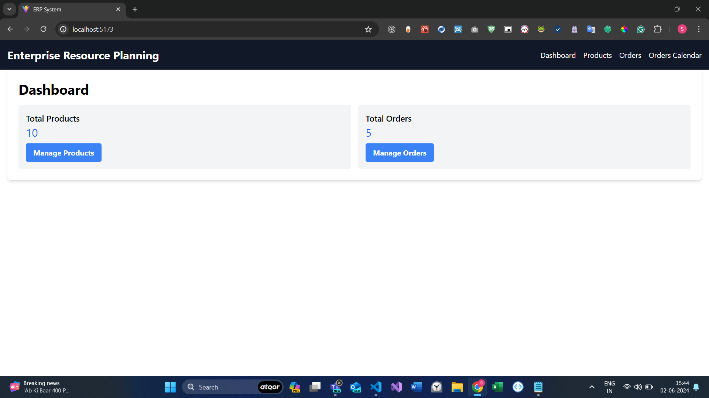

# Simplified ERP System

## Project Overview

The Simplified ERP System is a basic implementation of an ERP (Enterprise Resource Planning) system built using React. It includes a Dashboard, Products Management, Orders Management, and an optional Orders Calendar View.

## Objectives

- Develop a user-friendly interface for managing key business aspects.
- Utilize React for building modular components and managing the application state.
- Implement navigation between different sections using React Router.
- Create a responsive design suitable for both desktop and mobile devices.

## Pages and Features

### Dashboard

- Displays a summary of key metrics (total number of products, orders).
- Provides quick navigation links/buttons to Products and Orders management pages.

### Products Management

- Displays a list of products with details (name, category, price, stock quantity) using mock data.
- Allows adding, editing, and deleting products.

### Orders Management

- Displays a list of orders with details (order ID, customer name, order date, status) using mock data.
- Allows deleting orders.

### Orders Calendar View (Optional)

- Displays orders based on their expected delivery dates in a calendar format.
- Allows clicking on a date to view orders due for delivery on that day.

## Technology Stack

- **React**: For building the user interface.
- **React Router**: For navigation between pages.
- **CSS**: For responsive design.

## Getting Started

### Prerequisites

- Node.js and npm installed on your machine.

### Setup Instructions

1. Clone the repository:
   ```bash
   git clone https://github.com/your-username/simplified-erp-system.git
   cd simplified-erp-system
   ```


